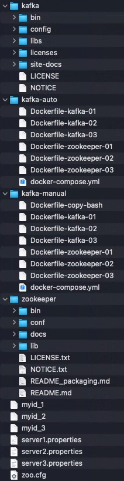

# docker-kafka-example
Kafka with ZooKeeper Example for Docker Compose
- - -
<br>

프로젝트 클론 후, Dockerfile들의 COPY에 필요한 파일들을 준비한다.  

<https://www.apache.org/dyn/closer.lua/zookeeper/zookeeper-3.8.0/apache-zookeeper-3.8.0-bin.tar.gz>  
위 페이지에서 받은 파일의 압축을 풀고, apache-zookeeper-3.8.0-bin 디렉터리의 이름을 zookeeper로 하여 함께 둔다.  
(./zookeeper/bin, ./zookeeper/conf, ...)

<https://www.apache.org/dyn/closer.cgi?path=/kafka/3.3.1/kafka_2.13-3.3.1.tgz>  
위 페이지에서 받은 파일의 압축을 풀고, kafka_2.13-3.3.1 디렉터리의 이름을 kafka로 하여 함께 둔다.  
(./kafka/bin, ./kafka/config, ...)  
<br>

- - -
<br>

docker-compose version은 v.2.15.1 이상  
`docker compose up -d`  
로 빌드 및 실행한다.
<br><br>

`docker attach kafka-cont-01`  
내부로 진입하여  
`/zookeeper/bin/zkServer.sh start`  
그러면  
```
ZooKeeper JMX enabled by default
Using config: /zookeeper/bin/../conf/zoo.cfg  
Starting zookeeper ... FAILED TO START
```
`FAILED TO START`로 뜨지만,  
이 예시에서는 **멀티 클러스터 환경**으로 설정한 것이라 클러스터 수가 부족하여 그런 것 뿐.  
내부에서는 다른 클러스터들을 기다리는 중이다.  
(확인하고 싶으면 `start` 대신 `start-foreground`로 디버깅 가능)  
다른 클러스터들도 마저 켜줘야하니 바로 다음으로 진행한다.

나머지 컨테이너들도 내부로 진입하여 반복해준다.  
`docker attach kafka-cont-02`  
`/zookeeper/bin/zkServer.sh start`  

`docker attach kafka-cont-03`  
`/zookeeper/bin/zkServer.sh start`  
<br><br>

그 후, 각 클러스터 내부(`kafka-cont-01`,`kafka-cont-02`,`kafka-cont-03`)에서 아래 명령어로 상태 확인.  
`/zookeeper/bin/zkServer.sh status`  
그러면  
```
ZooKeeper JMX enabled by default
Using config: /zookeeper/bin/../conf/zoo.cfg
Client port found: 2181. Client address: localhost. Client SSL: false.
Mode: leader 혹은 follower
```
로 잘 실행 중이며 `leader`나 `follower`로 결정된 것을 알 수 있다.  
<br><br>

각 클러스터 내부(`kafka-cont-01`,`kafka-cont-02`,`kafka-cont-03`)에서  
`/kafka/bin/kafka-server-start.sh /kafka/config/server.properties`  
위 명령어를 셋 모두에서 실행하여, 카프카 역시 **멀티 브로커**로 실행해준다.  
<br><br>

`docker attach kafka-cont-producer`  
이 컨테이너 내부에서  
`/kafka/bin/kafka-topics.sh --create --bootstrap-server kafka1:9092,kafka2:9092,kafka3:9092 --replication-factor 3 --partitions 1 --topic mytest`  
로 토픽을 하나 생성해본다.  
토픽이 생성되면  
`/kafka/bin/kafka-console-producer.sh --broker-list kafka1:9092,kafka2:9092,kafka3:9092 --topic mytest`  
로 해당 토픽에 대해 원하는 문구들을 publish해본다.  
<br><br>

`docker attach kafka-cont-consumer`  
이 컨테이너는 ENTRYPOINT가 미리 mytest 토픽을 subscribe하도록 되어 있다.  
(`ENTRYPOINT [ "/kafka/bin/kafka-console-consumer.sh", "--bootstrap-server", "kafka1:9092,kafka2:9092,kafka3:9092", "--topic", "mytest", "--from-beginning" ]`)  
실행되어 있었으니, log를 통해 문구들을 확인할 수 있다.  
<br><br>
- - -
`FROM openjdk` 도커 이미지로부터  
ZooKeeper나 Kafka에 대한 환경변수 설정 없이  
기본 apache 파일들(`apache-zookeeper-3.8.0-bin`,`kafka_2.13-3.3.1`)과 설정 파일들(`zoo.cfg`,`myid`,`server.properties`)만으로  
멀티 클러스터, 멀티 브로커 예시를 준비했다.  
단, 도커 컨테이너들의 네트워크와 호스트명 등과 consumer에 ENTRYPOINT로 고정된 특정 토픽의 subscribing 설정 등이 있으니,  
기본적인 설정을 이해했다면 이후엔 마음껏 연구해보시길.
